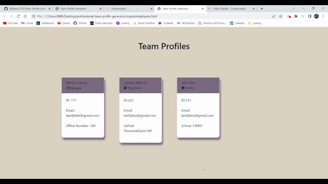

 # Team-Profile-Generator
  - William James
  - https://github.com/Williamj3795/Team-Profile-Generator

  ## Description
  
  - A command-line application that takes in info about employees, then generates an HTML webpage that displays summaries for each person.

  ## Table of Contents
  - [Installation](#installation)
  - [Usage](#usage)
  - [Tests](#tests)
  - [Credits](#contributors&credit)
  - [Tech](#tech)
  - [Questions](#questions)

  ## Installation
  To install this apllication, please follow the steps below:
  - Using a intergrated terminal, clone this repo, download node.js and run $npm start or$node server.js on the server.js file

  ## Usage

  In order to use this app, It is used through a command-line terminal

  ## Test

  - run $npm test on any test.js file in the ./test folder. The dependencies are, jest for running the provided tests, and inquirer for collecting input from the user.

  ## Contributors & Credit

  - N/A

  # Tech

  - HTML, CSS, Bootstrap, Javascript, Node.js, Express.js, JSON, Jquery

  # Functionality

  - 

  ## Questions
  if you have any questions about the repo, open an issue or contact me directly at Williamj3795@gmail.com.

